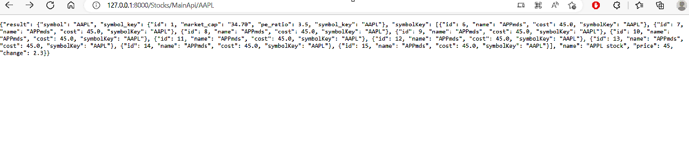
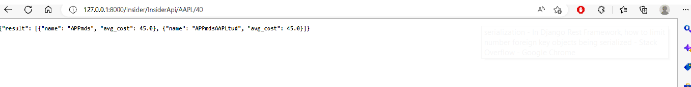

# MNM-Stocks

DjangoProject is the main one
Three Apps 
   -->Stock Data
   -->Insider Trasaction
   --->Valuation APP

=> output S.S 
--------------------1---------------------------

----------------2---------------------

------------------3----------------------

